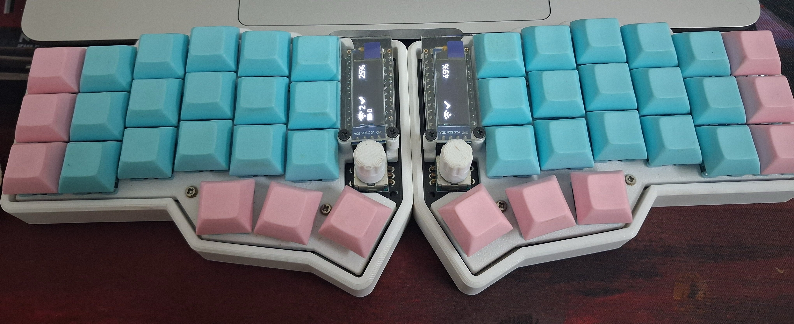
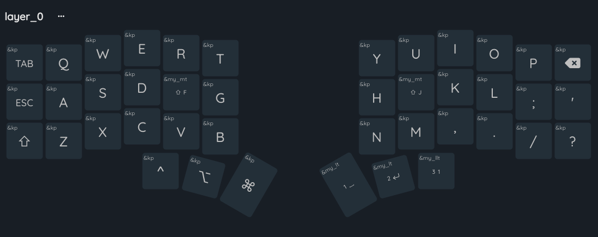
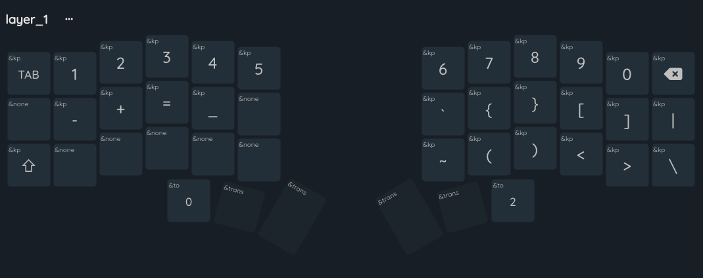
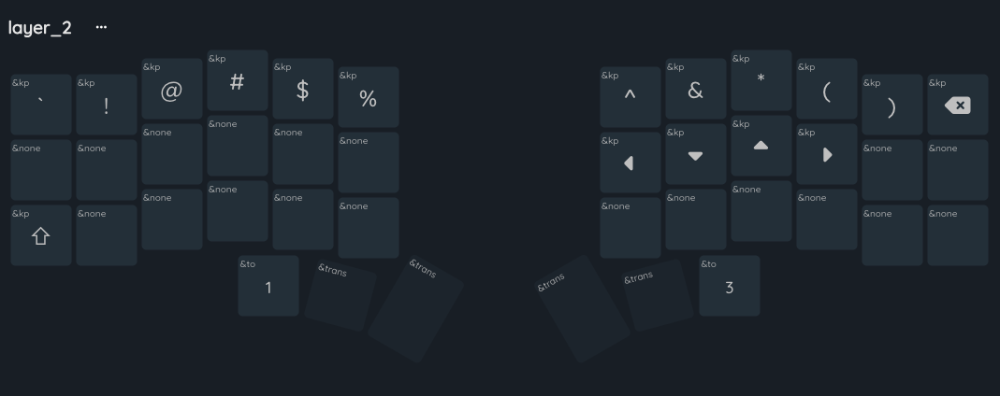
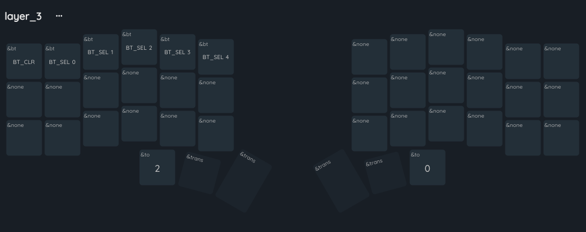

# Corne Keyboard ZMK Config

This repository contains the firmware configuration for my self-built Corne keyboard.

It includes:

- My custom keymaps
- Shield and layout configuration
- Build configuration for ZMK
- Board-specific settings for my setup

## Overview

This is my personal ZMK setup for a Corne-style split keyboard that I built myself. The repo is mainly for tracking my keymap, layer behavior, and hardware-related configuration in one place.

I use it as the source of truth for how my keyboard is configured and flashed.

## Project Structure

- [`config/corneroe.keymap`](/Users/aman/Desktop/aman/dev/zmk-corne/config/corneroe.keymap): Main keymap with layers, bindings, and custom behavior definitions
- [`config/corneroe.conf`](/Users/aman/Desktop/aman/dev/zmk-corne/config/corneroe.conf): Keyboard configuration options
- [`config/corneroe.json`](/Users/aman/Desktop/aman/dev/zmk-corne/config/corneroe.json): Layout metadata used for visual key layout mapping
- [`build.yaml`](/Users/aman/Desktop/aman/dev/zmk-corne/build.yaml): ZMK build configuration
- [`boards/shields/corneroe`](/Users/aman/Desktop/aman/dev/zmk-corne/boards/shields/corneroe): Custom shield files and board-specific setup

## Layers

The keymap currently includes these layers:

- `default_layer`: Main typing layer
- `lower_layer`: Numbers and symbols
- `raise_layer`: Navigation and extra symbols
- `connection_layer`: Bluetooth/device selection layer

## Features

- Custom hold-tap behaviors
- Layer-tap thumb keys
- Bluetooth profile switching
- Encoder bindings
- OLED support
- Split Corne physical layout

## Build

This repo is intended to be built with ZMK.

Typical workflow:

1. Set up a ZMK build environment
2. Point ZMK to this config repository
3. Build the firmware for the `corneroe` shield
4. Flash the firmware to both halves of the keyboard

## Images

### Keyboard Photos

### Key Layout Images
Layout images are screenshots take from this tool [nickcoutsos keymap editor](https://nickcoutsos.github.io/keymap-editor/)

#### Layer 0

#### Layer 1

#### Layer 2

#### Layer 3

## Notes

- This is a personal configuration, so bindings and layers are tuned to my workflow
- Keyboard photos and layer diagrams are included in this repository
